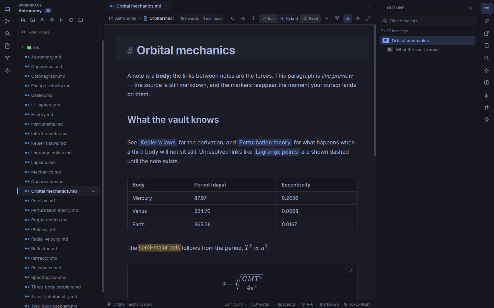
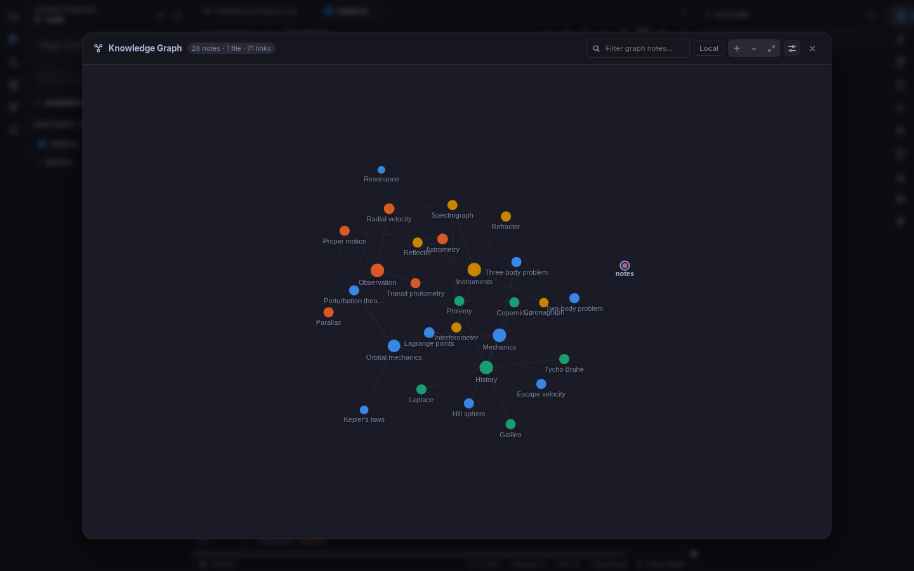
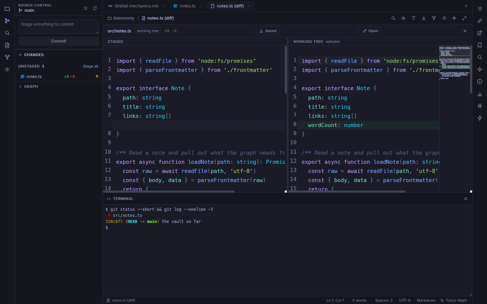
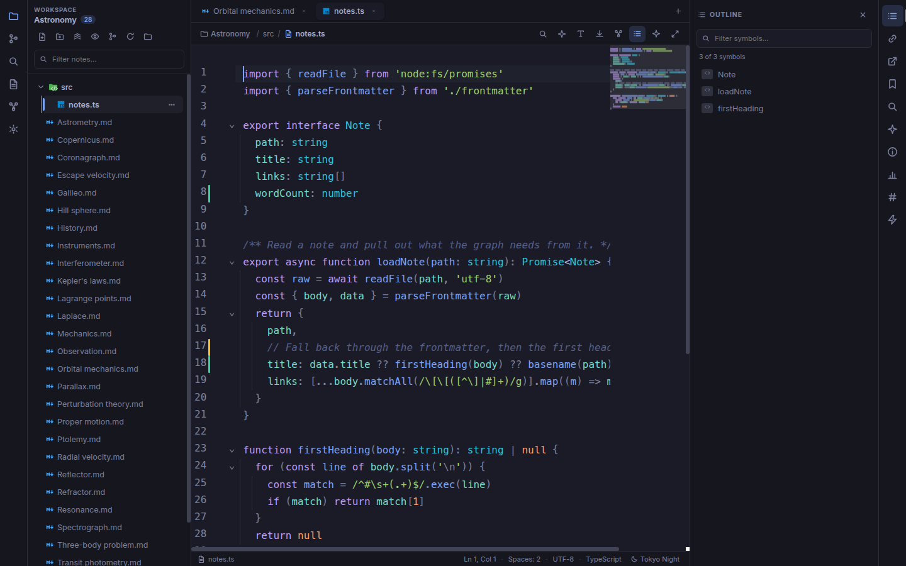

<h1 align="center">Orrery</h1>

<p align="center">
  A desktop markdown editor and knowledge base — with a real code editor, git and a terminal built in.
</p>

<p align="center">
  <a href="LICENSE"></a>
  
  
  
</p>

Point Orrery at a folder. Your notes stay ordinary markdown files on disk — no
database, no proprietary format — and `[[wikilinks]]` join them together. Orrery
reads the whole folder, so the structure you have built is something you can
see, search and walk through instead of something you have to remember.

That folder usually has code in it too. So Orrery edits code properly, shows you
git diffs, and gives you a shell, rather than pretending the rest of the
directory is not there.



**Why you might want it.** Note apps generally stop at notes, and code editors
generally do not model the links between documents. Orrery does both, because a
folder of notes and a folder of code are usually the same folder.

**Why you might not.** It is five days old. Version 0.1.0, 91 commits, one
developer, and only the Linux build is packaged today. The safety-critical parts
are covered — atomic writes, conflict detection on save, 689 unit and 180
end-to-end tests — but this is early software and it has not been run in anger
by anyone but its author. Keep your vault in git, which you should be doing
anyway, and which Orrery will now help you with.

## Writing

You are always editing real markdown. Formatting renders inline as you type —
headings size up, bold is bold, links show their label — and the syntax markers
reappear exactly where the cursor lands. The document is never converted to and
from a rich-text model, so the file on disk is what you typed.

Three modes on `Ctrl+Shift+1/2/3`: **Edit** (raw source), **Hybrid** (the
default), **Reading** (fully rendered, read-only).

Tables render as tables. `$inline$` and `$$block$$` maths through KaTeX.
` ```mermaid ` fences become diagrams. `==Highlights==` get a marker pen. Images
and diagrams open full screen. Long code fences scroll inside their own card
instead of dragging the whole document sideways.

**28 themes**, 17 dark and 11 light, each a six-line palette from which the full
token set is derived. All of them are checked for WCAG AA contrast and pointer
target size by a test that runs on every change, so a theme cannot ship
unreadable.

## Finding your way around a vault

`[[Wikilinks]]` connect notes by name — `[[Note]]`, `[[Note#Heading]]`,
`[[Note|alias]]`. Typing `[[` completes from the vault index, `Ctrl+click`
follows a link, and following one to a note that does not exist yet creates it.
Links written inside code fences are ignored, because a snippet showing the
syntax is not a reference.

**Backlinks** (`Ctrl+Shift+B`) list every note pointing at this one, with the
line each mention sits on. **Tags**, an **outline** and per-note **analysis**
each get a panel.

**Search** covers every text file in the vault, not only the notes: match case,
whole word, regular expressions, and comma-separated globs for which files to
include and exclude — `*.md`, `src/**`, `**/*.test.ts`. Binary files are skipped
by looking inside them rather than by trusting the extension.



The **graph** (`Ctrl+Shift+G`) is the whole vault as a map you can drag and zoom.
Hover a note to spotlight what it connects to, click to open it. Size the nodes
by links, influence or bridging; colour them by cluster or folder; narrow to
what is within _n_ hops of the note you are reading. Notes that are linked to
but do not exist appear as ghosts, so the gaps in your thinking are visible too.

`Ctrl+P` opens any note by fuzzy name and `Ctrl+Shift+P` runs any of 52
commands. In the same box, `:` jumps to a line and `@` jumps to a heading or a
declaration in the file you are looking at.

## Code, git and a terminal



**Git is built in.** Status, stage, unstage, discard, commit, a commit graph, and
change bars in the editor gutter. A diff opens as a tab with two real editors
side by side — syntax highlighting, undo, selection across lines — and the
working-tree side is editable and saves with `Ctrl+S`.

**A terminal** on ``Ctrl+` ``, running your own shell in the vault directory.



**Code files are treated as code**, not as markdown that happens to compile:
highlighting for 143 languages, folding, bracket matching, multiple cursors,
column selection and a minimap. Markdown's machinery is kept well away from
them, because reading `[1, 2, 3]` in a JSON file as a link is not a small
mistake.

**Language servers** are used where you already have them installed — hover
types, completion, diagnostics in the gutter, go-to-definition on `F12`. None
are bundled, and a language without one still gets highlighting and folding.

**Drawings** are a first-class file type. `.excalidraw` files open as an
Excalidraw canvas and are saved in Excalidraw's own format, so a board made here
opens on excalidraw.com and one made there opens here.

## AI, if you want it

Off until you configure it. Point it at the Claude API or a local Ollama model
in **Settings → AI**. Answers are grounded in the note you have open plus
matching passages from the vault, cited as `[file:line]`, and semantic search
runs over embeddings computed on your machine. API keys stay in the main process
and never reach the renderer.

## Install

Linux packages (`.deb`, AppImage) are on the
[releases page](https://github.com/iskandarputra/orrery/releases). macOS and
Windows targets exist in the build config but have to be built on those
platforms, and nobody has yet.

### From source

```bash
git clone https://github.com/iskandarputra/orrery.git
cd orrery
./orrery.sh setup     # dependencies, Playwright browsers, Rust if present
./orrery.sh dev
```

`./orrery.sh` with no arguments lists everything it can do, and
`./orrery.sh doctor` reports what is missing.

```bash
./orrery.sh check              # lint, typecheck, unit tests
ORRERY_XVFB=1 ./orrery.sh e2e  # the built app, driven by Playwright
./orrery.sh package            # .deb and AppImage into ./dist
```

Electron needs a display. Over SSH or in CI, `orrery.sh` runs the end-to-end
suite under `xvfb` by itself; `ORRERY_XVFB=1` forces that on a desktop, which is
how you reproduce a CI failure locally.

> **Linux note.** If Electron aborts with a SUID sandbox error, either
> `sudo chown root:root node_modules/electron/dist/chrome-sandbox && sudo chmod 4755 node_modules/electron/dist/chrome-sandbox`,
> or run with `ELECTRON_DISABLE_SANDBOX=1`. Packaged builds are unaffected.

### The Rust sidecar (optional)

Vault-wide search has a second implementation in Rust, in `native/`, spoken to
over the same framed JSON-RPC the app uses for language servers. On a 3,000-note
vault it answers in about 34 ms against roughly 543 ms for the TypeScript path.

It is optional and off by default. With no toolchain, no binary, or a crash, the
TypeScript search runs and nothing else changes. Both implementations are held
to each other by a differential test, so they cannot drift apart unnoticed.

```bash
./orrery.sh native                 # build it
ORRERY_RUST_SEARCH=1 npm run dev   # use it
```

## Extending it

Commands, editor extensions and whole document surfaces are contributed through
one small API:

```ts
export const myPlugin: OrreryPlugin = {
  id: 'my-plugin',
  name: 'My Plugin',
  activate(ctx) {
    ctx.registerCommand({ id: 'my.command', title: 'Do Thing', run: ({ store }) => … })
    ctx.addEditorExtension((settings) => myCodeMirrorExtension(settings))
    ctx.registerDocumentSurface({
      id: 'drawio',
      label: 'diagrams.net',
      claims: (name) => name.endsWith('.drawio'),
      Component: DrawioEditor
    })
  }
}
```

Wikilinks and the Excalidraw canvas are both built-ins written against exactly
this API, using nothing a third-party plugin could not. External plugins load
from `<userData>/plugins/*.js` at startup and call `orrery.register({...})` —
trusted local code, in the Obsidian sense.

## How it is built

Electron · React 19 · TypeScript (strict) · CodeMirror 6 · Zustand · zod.

```
src/core/      pure logic — no Electron, no DOM, no editor. 36 modules, 36 tested
src/shared/    the IPC contract both processes compile against
src/main/      files, git, language servers, terminal, embeddings
src/preload/   the one bridge
src/renderer/  React, CodeMirror, the interface
```

Nothing points back up that list, and `src/architecture.test.ts` enforces it:
a layer crossing or a runtime import cycle fails a test rather than the app.
Document text lives in CodeMirror state rather than React, so no large string
travels through a re-render on a keystroke. Every IPC channel is declared once
and validated with zod at the boundary. Saves are atomic and check the file's
mtime first, so a write cannot silently discard a change made outside the editor.

[ARCHITECTURE.md](ARCHITECTURE.md) is the longer version: what the layers are,
where new code goes, and which rules are checked by a test rather than asked for
politely.

## Contributing

Bug reports and pull requests are welcome — it is early enough that most things
are still easy to change. [CONTRIBUTING.md](CONTRIBUTING.md) covers running it
and what the code expects of you.

## Licence

MIT — see [LICENSE](LICENSE).

Orrery bundles fonts and libraries under their own terms, all permissive and
none copyleft. [THIRD-PARTY-NOTICES.md](THIRD-PARTY-NOTICES.md) lists every one
with its copyright holder; the full texts are in [`licenses/`](licenses/).

## About the name

An orrery is a clockwork model of a solar system. It does not merely hold the
planets — it shows how they move and what they pull on.

Inspired by [MarkText](https://github.com/marktext/marktext), and by Obsidian's
idea that a folder of plain files is a good enough database.
